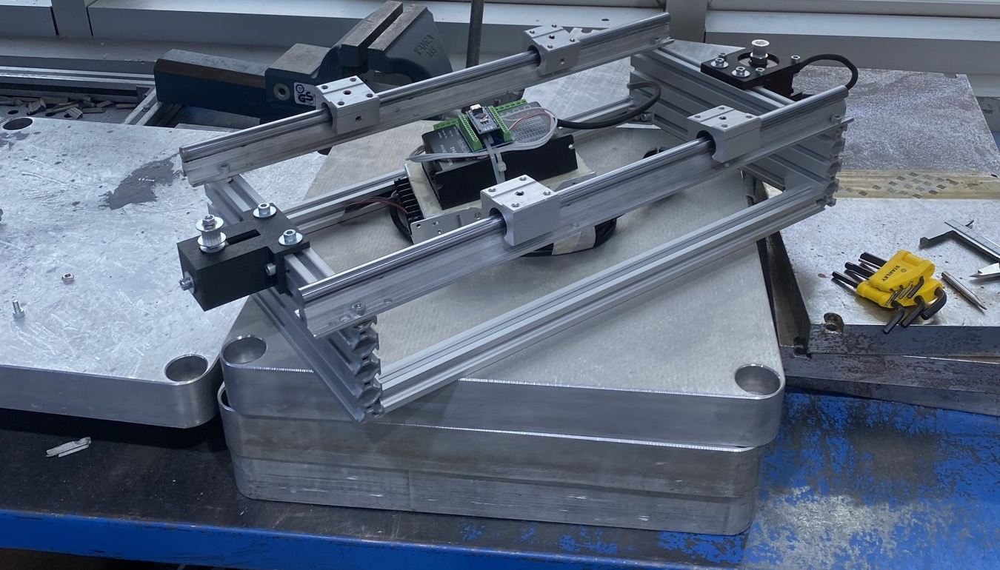
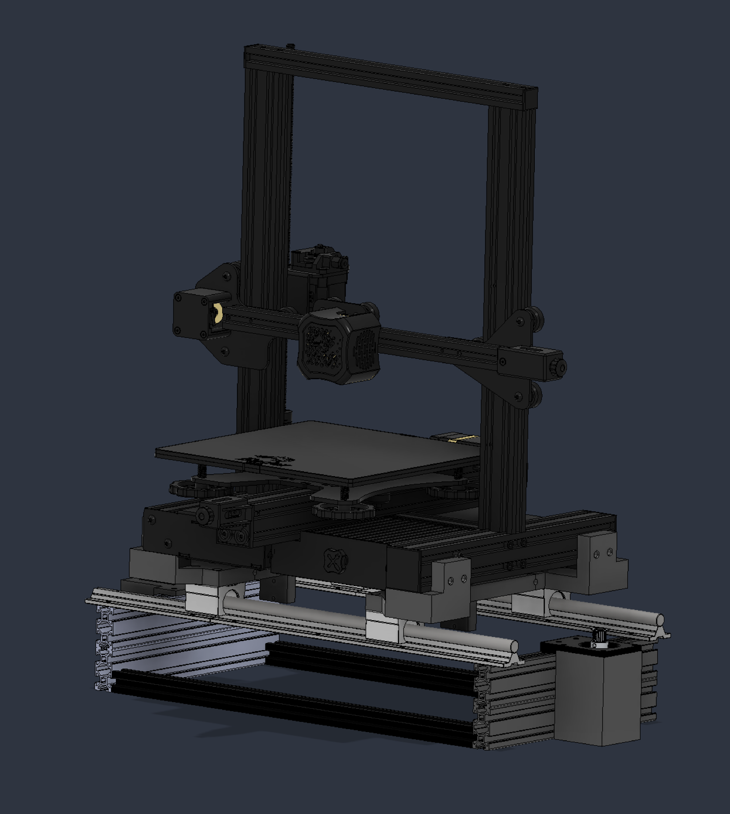

# Single-Axis Shaker Rig

A benchtop single-axis shaker table that replays **recorded acceleration histories** — in
particular real ISS microgravity data — into a desktop FDM 3D printer bolted on top of it.
Open hardware: bill of materials, sizing calculations, wiring, firmware and control
software are all here.

Built for a vibration study on in-space manufacturing; useful on its own as a low-cost
arbitrary-waveform shaker for anything that fits on a 300 × 320 mm table.



*The stage mid-build: 20×20 extrusion frame, two supported Ø12 rails, four SBR12UU
bearings, NEMA 23 at one end, driver and supply alongside.*

## What it does

The table follows an arbitrary position waveform — a CSV recording, a sine, or a
logarithmic sweep — with the moving mass of a full 3D printer on it. Timing lives on a
microcontroller; the decisions live on the PC.

| | |
|---|---|
| Axis | 1 (horizontal, belt-driven linear stage) |
| Moving mass | ~9 kg (7.8 kg printer + printed table + carriage) — being re-derived, see below |
| Resolution | **12.5 µm/step** (20-tooth GT2, 1/16 microstepping) |
| Usable stroke | ±150 mm (rail-limited; protocol range ±409 mm) |
| Update rate | **1 kHz** position setpoints, streamed over USB |
| Peak step rate | 20 steps/tick = 250 mm/s |
| Sine range | 0.5 – 200 Hz, amplitude auto-capped against the step-rate ceiling |
| Peak acceleration | ~1.08 m/s² at the 25× replay scale (2.9 N on the carriage) |
| Torque margin | **13.5×** at 25× scale (95 mN·m required, 1.28 N·m dynamic available) |
| Cost | **under 200 USD** without the printer and host PC |

Every number above is derived in **[docs/design-rationale.md](docs/design-rationale.md)**,
not assumed. One caveat: the sizing was done for a 6 mm laser-cut aluminium table. That
plate could not be cut locally, so the table is 3D printed instead — lighter, which moves
the torque figures in the safe direction, but the exact numbers are pending the printed
table's mass.

The printer mounts on top of the carriage. The full assembly, drawn before the build:



More views — front, left and bottom — are in [`hardware/cad/`](hardware/cad/).

## How it is put together

```
PC (Python/Tk)  ──USB 250 kbaud──►  Arduino Nano  ──STEP/DIR──►  DM542  ──►  NEMA 23
   waveform prep,                    Timer2: 1 kHz tick          48 V         57HB84-154
   safety checks,                    Timer1: even step spacing   optoisolated
   flow control                      absolute int16 positions
```

**Why the split.** Step pulses have to be evenly spaced. A general-purpose OS cannot
guarantee that — it preempts the process whenever it likes, and the resulting jitter comes
out of the motor as vibration. On a rig built to *measure* vibration, that means part of
what you measure is noise you generated yourself. So the Nano owns timing in hardware
(Timer2 sets a target position every millisecond, Timer1 spreads that tick's steps evenly
across it) and the PC owns everything else.

**Why absolute positions in the stream, not deltas.** The waveform is streamed as int16
*absolute* step positions. With deltas, one dropped sample would become a permanent
offset, silently, and the table would sit in the wrong place for the rest of the run. With
absolute positions the next sample corrects it.

**Why underruns are counted.** USB serial is not real-time. If the laptop stalls, the
board's ring buffer empties and the table stops mid-waveform. That failure is *silent* —
the recording looks normal, there is just no vibration in it. So every starvation is
counted and reported; a run with `underrun > 0` is marked SUSPECT and must not be
analysed.

Full command set: **[docs/serial-protocol.md](docs/serial-protocol.md)**.

## Documentation

| | |
|---|---|
| [Design rationale](docs/design-rationale.md) | belt vs. crank, torque budget, belt stiffness, why 48 V, datasheet verification |
| [Bill of materials](docs/bill-of-materials.md) | what was actually ordered, with specs and substitution notes |
| [Wiring](docs/wiring.md) | driver, motor, Nano pinout, DIP switches, grounding |
| [Assembly](docs/assembly.md) | build order and the tolerances that matter |
| [Commissioning](docs/commissioning.md) | seven acceptance tests to run before trusting any measurement |
| [Serial protocol](docs/serial-protocol.md) | command set, framing, flow control |
| [Examples](examples/) | two synthetic waveform files and the script that regenerates them |
| [Safety](docs/safety.md) | hard stops, current limits, what not to skip |

## Software

The desktop application (Python + Tkinter) drives the rig in four modes:

- **Manual** — homing, software limits, jog, go-to-position.
- **Sine** — for transmissibility sweeps. Frequency and amplitude are changeable *while
  running*; the board preserves phase and centre, so the table neither jumps nor walks.
  Amplitude self-limits against the step-rate ceiling, so at 2 Hz you get 15 mm and at
  80 Hz you get 0.37 mm — the app settles on the largest legal value instead of refusing.
- **Sweep** — logarithmic f1 → f2. Equal time per octave; a linear sweep spends almost all
  its time at the top end and never samples the bottom.
- **CSV waveform** — pick a file and a column, declare the unit. `m/s2` or `g` are double
  integrated in the frequency domain to displacement. Two synthetic files to try are in
  [`examples/`](examples/).

Before *Play* unlocks, five checks must all pass: stroke inside the software limit, step
rate under the ceiling, positions inside int16, peak torque under half of what the motor
can deliver, and the waveform starting and ending at zero.

<!-- PHOTO: application screenshot -->

### Running it

```bash
cd software
python3.12 -m venv --system-site-packages .venv
./.venv/bin/pip install -r requirements.txt
./.venv/bin/python app.py          # runs without hardware, in simulation mode
```

Needs a Python with Tkinter (`brew install python-tk@3.12` on macOS Homebrew).

Firmware: open `firmware/shaker/shaker.ino` in the Arduino IDE, board **Arduino Nano**,
processor **ATmega328P**. Flash is 28 % full, RAM 41 %.

### Tests

Both ends are tested without any hardware attached.

```bash
cd firmware/test
c++ -std=c++11 -O1 -Istub -o sim sim_main.cpp && ./sim     # firmware logic

cd software
./.venv/bin/python test_waveform.py                        # CSV → steps, safety checks
./.venv/bin/python test_integration.py                     # both ends together
./.venv/bin/python test_layout.py                          # UI layout regressions
```

`sim_main.cpp` stubs the AVR registers and `Serial`, then `#include`s `shaker.ino`
directly — the code under test is exactly the code that gets flashed, and ticks are driven
by hand so results are reproducible. `test_integration.py` runs the firmware as a
subprocess and connects the application to it; what it tests is not either side
internally but the **agreement between them** — byte order, framing, flow credit. Those
are the bugs that pass both unit test suites and only surface when the ends meet.

## Status

**Under construction.** The frame, rails, bearings, motor and electronics are assembled and
the drive chain runs end to end — firmware, streaming and the control application all work
against the real board. Still to fit: the belt, the printed table, the brackets that hold
the printer, and the printer itself. The photographs in [`photos/`](photos/) show the stage
as of that point; [the CAD views](hardware/cad/) show where it is going.

After that come the [acceptance tests](docs/commissioning.md). No measurement from this rig
means anything until those pass.

## Licence

| What | Licence |
|---|---|
| Source code — `firmware/`, `software/`, `examples/` | [MIT](LICENSE) |
| Documentation, drawings, CAD renders, photographs — `docs/`, `hardware/`, `photos/`, this README | [CC BY 4.0](LICENSE-DOCS) |

Nothing in this repository is redistributed from a third party. The printed parts are all
original designs for this rig; `pyserial` and `numpy` are ordinary dependencies; the
firmware is compiled against a locally installed Arduino core that is not included here.

## Context

This rig was built as the disturbance source for a study on active vibration compensation
in microgravity additive manufacturing, accepted as an Interactive Presentation at the
**77th International Astronautical Congress** (IAC 2026, Antalya, paper
`IAC-26,A2,IP,17,x113015`). This repository covers **the apparatus only** — no
experimental results, which appear in the IAF proceedings.

Ali Dereyurt
