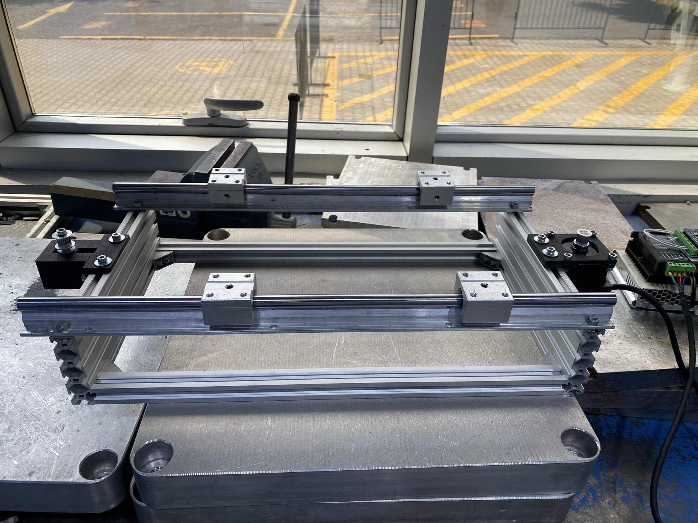

# Assembly

Order matters: each step is only checkable while the next one is still off.

1. **Frame.** A rectangle from the 20×20 extrusion. Square the corners; fit the damping
   feet. The wide 20×25 corner brackets carry the moment from the printer's mass — the
   hidden internal connectors are not enough here.

2. **Rails.** Bolt the supported rails to the frame. **Parallelism is the critical
   tolerance:** slide the carriage along by hand over the whole length; it must not bind
   anywhere. A rig that binds at one end will show up later as a position error you will
   spend a day blaming on the firmware.

3. **Carriage.** Four SBR12UU bearings into the printed body, onto the rails. Unloaded, it
   must push with one finger.

4. **Motor and belt.** Motor at one end, the idler at the other on its printed tensioner —
   the tensioner slides along the belt line, so preload is set by moving the idler rather
   than by stretching anything. Belt line parallel to the rails. Clamp the belt and
   tension it — **taut enough to give a solid
   note when plucked, and no more**; overtightening loads the rail bearings. Target preload
   is ≥ 20 N, about 1.5× the peak transmitted force. Practical check: finger pressure
   should deflect it no more than 1–2 mm.

5. **Adapters.** Bolt a printed adapter to each bearing block. There is no table: these
   four adapters are the entire load path between the bearings and the printer's frame
   ([§9](design-rationale.md#9-the-printers-frame-is-the-carriage)).

6. **Electronics.** See [wiring](wiring.md). Set the driver current to about 70 % of the
   motor's rated value before powering the motor for the first time.

7. **Hard stops.** Mechanical stops 2 mm outside the software limit, both ends.

8. **Payload.** Bolt the printer's four extrusion corners down onto the adapters —
   **bolted, not clamped or taped.** Orient it so that the shaking axis is perpendicular to
   the surface you will be measuring.

9. **Sensors.** One accelerometer under the table, one on the payload. Mount them rigidly;
   a loose mount invents resonances that are not there.

Then run every test in [commissioning](commissioning.md) before trusting a single
measurement.
