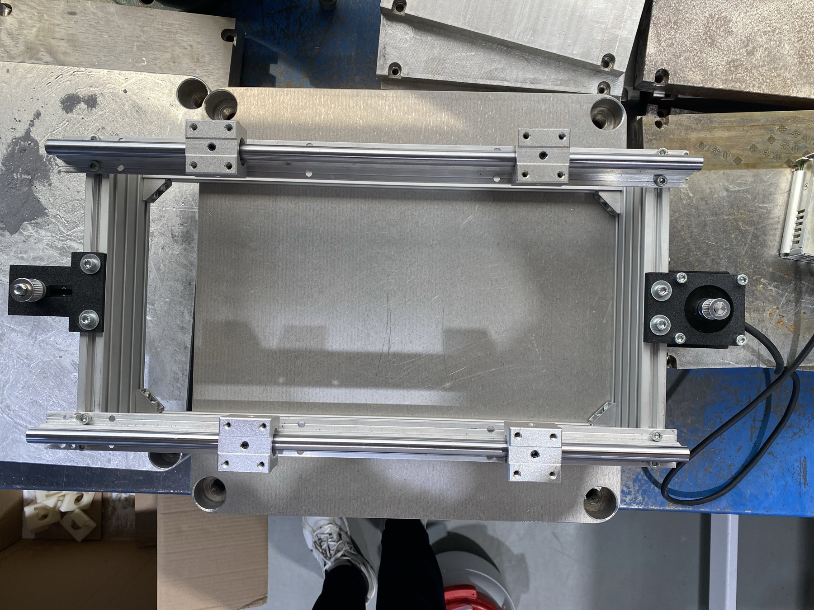
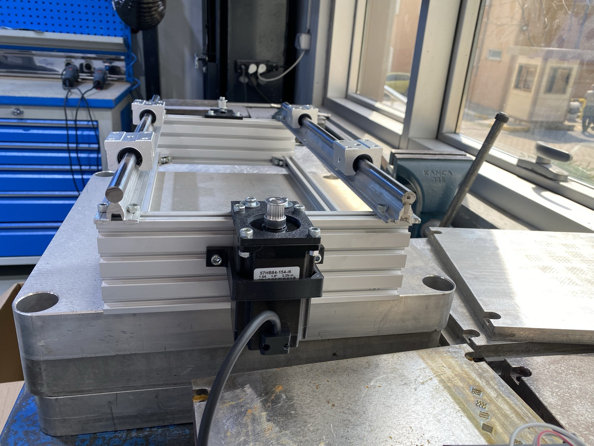

# Design rationale

Every number in the README comes from here. The order below is the order the decisions
were actually made in, including the one that got reversed.

---

## 1. Belt-driven stage, not a crank

The first design was a crank-and-connecting-rod: a motor turns, an eccentric pin pushes a
rod back and forth. It works, and it was fully sized. It lost anyway, once it became clear
that the drive signal is an **arbitrary waveform** rather than a sinusoid.

A crank's advantage is that it converts rotation into a bounded stroke for free. But to
follow an arbitrary position you have to invert the geometry — θ = arccos(x/r) — which adds
a non-linear transform between what you command and what you get, and compresses
resolution towards the ends of the stroke.

| | Belt-driven linear stage | Crank and rod |
|---|---|---|
| Resolution (NEMA 17, 1/16) | **12.5 µm/step** | 31.4 µm/step (mid-stroke) |
| Usable stroke | length of the rail | 2 × 0.7 × radius |
| At 50× replay scale | fine | **14.8 % clipped** at r = 16 mm |
| Position → command | direct | arccos transform |
| Construction | a standard printer axis | custom parts |
| Inherent safety | needs a software limit | **physical stroke limit** |

The belt stage wins on four of six, and the one real advantage of the crank — you cannot
drive the printer into a wall even with a firmware bug — is recovered with **mechanical
hard stops** 2 mm outside the software limit.

Sizing for the crank variant is kept in [`crank-variant.md`](crank-variant.md) for anyone
who wants the bounded-stroke property more than the resolution.

---

## 2. The printer choice dominates everything

This was the single most consequential decision, and it was nearly made by accident.

The working assumption early on was a "light printer", ~1.5 kg. The printer actually
available is a **Creality Ender-3 V2**. Pulled from its CAD model, the bounding box is
547 × 747 × 571 mm including the spool arm; catalogue mass is **7.8 kg**. That is five
times the assumed mass and twice the assumed footprint, and it propagates into the rail
length, the table size, the motor frame size and the belt width.

| | Light printer | **Ender-3 V2** |
|---|---|---|
| Printer | 1.5 kg | **7.8 kg** |
| Table as planned | 240 × 240 (0.93 kg) | 300 × 320 (1.56 kg) — *dropped, see §9* |
| Carriage | 0.5 kg | 1.2 kg |
| **Moving mass** | **2.9 kg** | **10.56 kg** |
| Force at 25× | 3.2 N | **13.0 N** |
| Torque required | 20 mN·m | **95 mN·m** |
| NEMA 17 margin (0.45 N·m) | 22× ✓ | **4.6 – 5.2× ✗** |
| Rail length | 300 mm | **≥ 500 mm** |

*Two 500 mm supported rails, four bearings, motor at one end and the toothed idler at the
other — the layout that came out of the table above.*

**The table was dropped entirely.** The aluminium plate could not be cut locally, and
looking again at the problem there was no need for one: the Ender-3's own frame is
aluminium extrusion, and the four bearings can bolt straight to it. See
[§9](#9-the-printers-frame-is-the-carriage).

One caveat worth stating plainly: the Ender-3 is a bed-slinger. Its own Y axis throws the
bed back and forth during a print, which pushes against the shaker table. A printer with a
stationary bed would have been the better choice and was the stated criterion — the
Ender-3 was used because it was the machine on hand.

---

## 3. Torque budget

Margin is taken against **acceleration torque**, not holding torque. Holding torque is a
standstill figure and this rig never stands still. Load inertia alone is also not the whole
story: the rotor's own inertia and friction have to be in the budget. Friction is quoted as
a range because it depends on build quality — a clean linear bearing rolls at µ ≈ 0.004,
misalignment and preload take it to 0.02.

Peak acceleration is computed **from the signal itself**, not from a single-frequency
approximation. The recording carries content out to 5 Hz, so estimating from a 1.5 Hz
equivalent understates acceleration by roughly a factor of two.

| Replay scale | Stroke | Peak velocity | Peak accel. | Force (2.7 kg) |
|---|---|---|---|---|
| 10× | 8.2 mm | 35 mm/s | 431 mm/s² | 1.2 N |
| **25×** | **20.4 mm** | **88 mm/s** | **1078 mm/s²** | **2.9 N** |
| 50× | 40.7 mm | 177 mm/s | 2156 mm/s² | 5.8 N |

With the configuration as sized — 10.56 kg moving (aluminium table; see the note in §2),
20-tooth pulley (40 mm/rev), the motor below:

| | 25× | 50× |
|---|---|---|
| Torque required | **95 mN·m** | 174 mN·m |
| Margin on 1.28 N·m dynamic | **13.5×** ✓ | 7.4× ✗ |
| Inertia ratio | **8.1 : 1** ✓ | 8.1 : 1 ✓ |
| Belt stretch vs. one step | **8.5 / 12.5 µm** ✓ | 17.1 / 12.5 ✗ |

**25× passes all three checks. 50× is beyond this rig** — both torque and belt stretch run
out. If 50× is ever needed, a 16-tooth pulley fixes it: torque scales with radius squared,
so it falls to 157 mN·m, the inertia ratio improves, and resolution improves to 10.0 µm as
a bonus. The price is a step rate of 17 671 s⁻¹, still under the driver's 20 000 limit.

An inertia ratio under 20:1 is the reason the motor stays in control through direction
reversals, which on this waveform happen constantly.

---

## 4. Verifying the motor against its datasheet

The motor is a **NEMA 23, 57HB84-154**. The retail listing claims 2.2 N·m holding torque.
The manufacturer's datasheet says **1.6 N·m** — the listing is inflated by 38 %.

*The claim is printed on the motor itself: `57HB84-154-i6 · 1.5 A · 1.8° · 2.2 N·m`. The
manufacturer's datasheet for the same part says 1.6 N·m.*

| | Datasheet | Listing |
|---|---|---|
| Holding torque | **1.6 N·m** | 2.2 N·m ⚠ |
| Rated current | 1.5 A/phase | 1.5 A ✓ |
| Phase resistance | 5.0 Ω | — |
| **Inductance** | **10 mH/phase** | — |
| Rotor inertia | **530 g·cm²** | — |
| Mass | 1.13 kg | — |
| Body length | 84 mm | 84 mm ✓ |

Rated voltage is therefore 1.5 × 5 = **7.5 V**.

The inflated figure does not change the outcome — 1.6 N·m is still ample — but every
calculation here uses the datasheet value. The inductance is the number that actually
mattered, and it is the one no listing publishes; see §6.

---

## 5. Belt width is a design variable, not a constant

Belt stiffness scales with width. The carriage is at its softest mid-stroke, where the two
runs act in parallel: `k = 4·EA/L`. For steel-cord GT2, EA ≈ 100 000 N per 6 mm of width.

If the belt stretches by more than one step, the step the motor takes is absorbed by the
belt instead of moving the table.

| | Light printer · 300 mm rail · 3.2 N | **Ender-3 · 500 mm rail · 13.0 N** |
|---|---|---|
| GT2-**6** | 2.4 µm ✓ | **16.2 µm ✗** (step is 12.5) |
| GT2-**10** | 1.5 µm ✓ | **9.7 µm ✓** |
| GT2-15 | 1.0 µm ✓ | 6.5 µm ✓ |

**Do not use GT2-6 with a heavy printer.** A long rail plus a heavy load stretches a 6 mm
belt by more than a microstep. Three further belt requirements:

- **Steel cord, not glass fibre.** Glass-fibre cord stretches three times as much — 49 µm
  in this configuration. The listing has to say steel.
- **Open-ended, by the metre.** It gets clamped to the carriage and pulled by a tensioner,
  not looped. A 500 mm rail needs ~1040 mm of loop; buy 1.5 m for clamps and tension.
- **Preload ≥ 20 N** (about 1.5 × the peak transmitted force of 13 N), so both runs stay
  taut. A slack belt is backlash, and backlash means not arriving where you were told to
  go. In practice: pressing with a finger should deflect it no more than 1–2 mm, and
  plucking it should give a solid note.

The **idler must be toothed and on a bearing**. In this layout the belt wraps 180° around
the idler with the teeth facing inwards; a flat idler is made for the back of the belt and
will let it walk.

---

## 6. Why 48 V

This is the calculation that the retail listing's missing inductance figure would have
hidden. The supply voltage has to push current through the phase inductance fast enough to
settle *within one microstep period*, or the current waveform is distorted and the motor
generates vibration of its own — which, on a rig built to measure vibration, is exactly the
noise you cannot afford.

Settling time per microstep, against the available period:

| | 25× (141 µs period) | 50× (57 µs) |
|---|---|---|
| 24 V | 123 µs = 87 % ⚠ | 215 % ✗ |
| 36 V | 82 µs = 58 % | 143 % ✗ |
| **48 V** | **61 µs = 43 %** ✓ | 107 % ✗ |

At 24 V the current barely keeps up with the microstep. **48 V.**

Current draw is modest: copper loss is 2 × 1.5² × 5 = **22.5 W**, i.e. 0.55 A average at
48 V. A 48 V / 3 A supply is enough; 5 A is comfortable.

**Regeneration is not a concern here**, which is worth showing rather than assuming: during
deceleration the copper loss (1107 mJ) is 22 times the kinetic energy being shed (50 mJ).
The energy is dissipated as heat in the motor, not pushed back into the supply. No brake
resistor, no extra bulk capacitance.

---

## 7. Driver current is set below rated

The DIP switches are set to **1.04 A** RMS, not the motor's rated 1.5 A.

At 1.5 A the motor dissipates 22.5 W, and the natural-convection limit for this frame is
roughly 20–25 W. At 1.04 A it dissipates 10.8 W and the torque margin is still 9.4×.
Buying margin you do not need with heat you have to get rid of is a bad trade on a rig
whose whole purpose is a clean vibration environment.

Microstepping is set to **3200 pulses/rev**, which with a 20-tooth GT2 pulley (40 mm/rev)
gives **12.5 µm/step**.

Note also that a TMC2209-class driver **cannot** run this motor — 1.4 A RMS against a
motor that wants 1.5 A rated. It needs a DM542 or TB6600 class driver.

---

## 8. Resolution reality check

At the 25× replay scale the generated trajectory has these properties:

| | |
|---|---|
| Moves per cycle | 6 257 |
| Cycle duration | 125.1 s |
| Stroke | −10.05 … +10.31 mm |
| Resolution | 12.5 µm/step |
| Peak velocity | 89 mm/s |
| Steps per cycle | 235 250 |
| Sample period | 20 ms |

Median move distance is 0.32 mm and the largest is 1.77 mm. **2.4 % of moves are smaller
than a single step** — these are the pauses at the signal's turning points, and the driver
folds them into the next move. Not a problem, but it is the honest statement of where the
resolution limit sits: if finer is needed, a 16-tooth pulley (10 µm/step) or 1/32
microstepping.

---

## 9. The printer's frame is the carriage

The plan called for a 300 × 320 × 6 mm aluminium plate: a table, bolted to a carriage,
with the printer standing on it. That plate could not be laser cut locally — and the
substitute is not a printed plate. It is no plate at all.

The Ender-3's frame is already aluminium extrusion with four corners. So the four SBR12UU
bearings bolt **directly to the printer's own extrusion**, through four thick printed ABS
adapters. The printer is not a payload sitting on a carriage; the printer *is* the carriage.

This removes the part that would have been the weak link. A plate spanning between supports
is loaded in **bending**, where stiffness goes as `E · t³` — material modulus dominates, and
a printed plate would have had to be ~20 mm thick just to match 6 mm of aluminium. Four
short adapters clamped between a bearing block and an extrusion are loaded along the drive
axis instead, in **compression and shear**, where stiffness goes as `E · A / L` — stubby
geometry, not modulus, decides the answer.

Peak transmitted force at the 25× replay scale is 13 N, so about 3.2 N per adapter:

| Adapter, roughly | Stiffness `E·A/L` | Deflection at 3.2 N |
|---|---|---|
| 30 × 30 mm, 15 mm thick | 1.2 × 10⁸ N/m | 0.027 µm |
| 40 × 40 mm, 15 mm thick | 2.1 × 10⁸ N/m | 0.015 µm |
| 25 × 25 mm, 20 mm thick | 6.3 × 10⁷ N/m | 0.052 µm |

Against one motor step of 12.5 µm, and against the 8.5 µm of belt stretch already in the
budget in §5. The adapters are two to three orders of magnitude stiffer than the belt: ABS
being thirty times softer than aluminium simply does not matter in this load path.

**What it changes in the numbers.** Without a table, the moving mass is the printer plus
four bearing blocks plus four adapters — roughly 9 kg rather than 10.56. Required torque
falls to about 82 mN·m and the margin widens to ~15.7×. (Worth weighing rather than
estimating, once it is together.)

**What it changes in what has to be measured.** The compliance question has not gone away,
it has moved: the printer's own frame is now part of the transmission path between the
rails and the print head. A resonance in that frame is a resonance in what the rig delivers.
That is exactly what the transmissibility sweep is for — accelerometer on the rail,
accelerometer on the print head, sine sweep from 0.5 Hz up, and look at the ratio. It is
also the second reason the bed-slinger Y axis is a nuisance: it moves mass inside the
structure being shaken.

The printed adapters do still creep under a sustained 7.8 kg, mostly in compression. Bolt
torque and squareness are worth re-checking between runs, alongside the acceptance tests.
