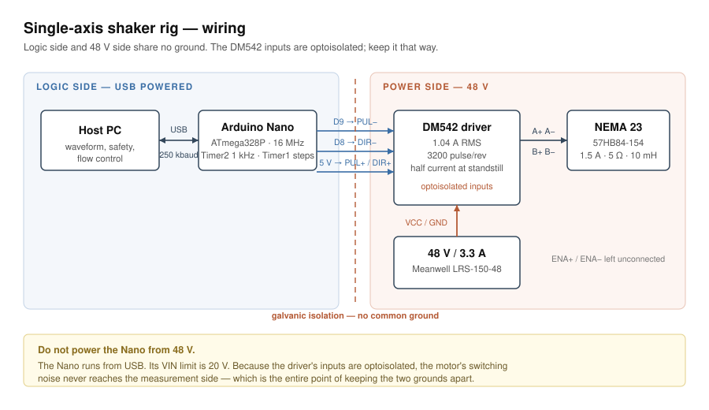

# Wiring

## Connections

| DM542 terminal | Goes to |
|---|---|
| PUL+ | Nano 5 V |
| PUL− | Nano **D9** |
| DIR+ | Nano 5 V |
| DIR− | Nano **D8** |
| ENA+ / ENA− | leave unconnected |
| VCC / GND | 48 V supply |
| A+ A− / B+ B− | the motor's phase pairs |

Power the Nano from **USB**. Do not connect it to 48 V — its VIN limit is 20 V.

The DM542's inputs are optoisolated, so there is no common ground between the Nano and the
48 V side. Keep it that way: it is why the motor's switching noise never reaches the
measurement side. On a rig built to measure vibration, electrical noise on the
accelerometer path is indistinguishable from the thing you are trying to measure.

Pulse width is 4 µs in firmware; the DM542 needs about 2.5 µs minimum.

## DIP switches

The table is printed on top of the driver, and the combinations differ between clones —
read yours rather than copying numbers.

| Setting | Value | Why |
|---|---|---|
| Current | **1.04 A** RMS | At the rated 1.5 A the motor dissipates 22.5 W against a natural-convection limit of ~20–25 W. At 1.04 A it dissipates 10.8 W and the torque margin is still 9.4× |
| Standstill current | half | The table is horizontal; holding it needs no torque |
| Microstepping | **3200 pulses/rev** | With a 20-tooth GT2 pulley (40 mm/rev) → **12.5 µm/step** |

## First power-on test

With firmware flashed, in the application:

1. **Connect**
2. **Set zero**
3. Enter **40** in the go-to box, press **go**

The table must move exactly **40.0 mm**. Measure it with calipers.

| What you measure | What it means |
|---|---|
| 40 mm | current, microstepping, pulley and wiring are all correct |
| 20 or 80 mm | microstepping is on the wrong DIP row |
| vibrates, does not move | motor phase pairs are swapped |
| slips | current too low, or the belt is slack |

Do not proceed to any other measurement until this holds. Every number that follows rests
on it.
